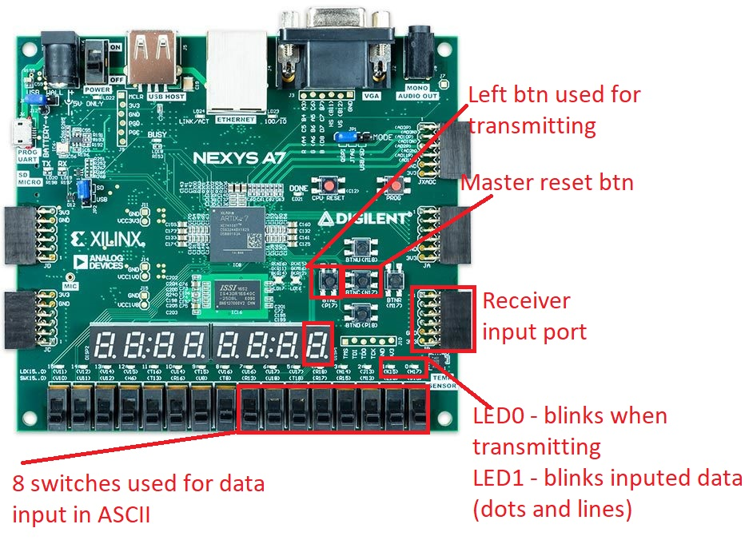
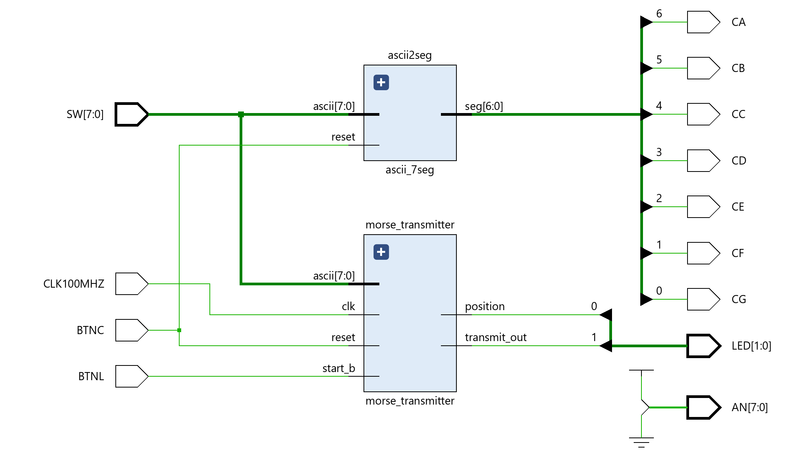
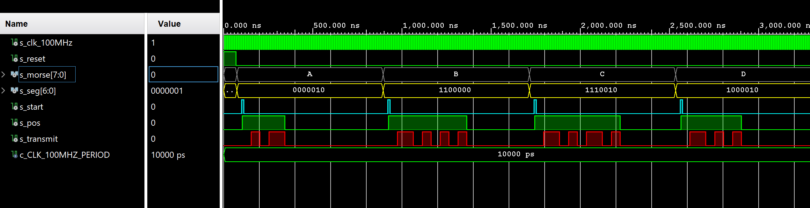
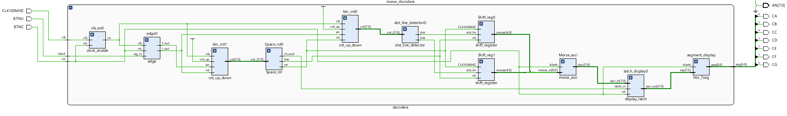
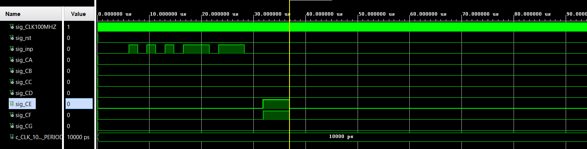

# MORSE CODE TRANSMITTER and RECEIVER

### Team members

* Ivan Lipták [@240942](https://github.com/IvoSvk)(responsible for VHDL transmitter module and cooperation with receiver)
* Jan Ševčík [@xsevci71](https://github.com/JanSevcikk)(responsible for VHDL project github completation and documentation and transmitter module)
* Martin Monček [@240954](https://github.com/)(responsible for  VHDL receiver module and documentation fixes)

### Table of contents 

* [Theoretical description and explanation](#theo)
* [Goals](#goals)
* [Hardware description of demo application](#hardware)
* [Software description](#software)
* [Component(s) simulation](#component)
* [Instructions](#instruction)
* [References](#references)

## Theoretical description and explanation 

This project shows how to complete assingment of creating Morse code transmitter and receiver which works correctly and is able to transmiter user chosen message and receive generated message. 
First objective is to choose button and switches which will be operate the device. We chosen way of using ASCII to binary code. On switches you chose value which is showed on 7seg display and is send by button. 

Receiveng part needs to accept message on port JA. Message is received by using edge detector, which chooses rising edge and chooses if tha value is 0 or 1. Then the code changed fro

## GOALS of the work
The main goal of this project is to create a Morse Code Transmitter and Reciever. Project is made within subject Digital Electronics (2022/23). For project is used board Arty-A7-50T [ref](https://digilent.com/shop/arty-a7-100t-artix-7-fpga-development-board/). On this board is used buttons, switches and I/O ports and showing input and output on the 7-segment display. For coding is used IDE Vivado 2020.2.  

First part was to made transmitter. Signals are entered via switches, like in real-life morse code usage (like telegraphs) - on switches you choose value in ASCII code (binary) with 8 switches (8bit binary code) by switching switches whichc changes values from 0 to 1. Chosen value is showed on right 7-seg display unit. After value is chosen you can send Morse code by pushing left push button. LED 0 blinks red light when there is sendind procedure. And LED 1 blink the morse code which you are sending. 

Second part is receiver, which needs to receive standardized input send by other arduino device via. First you choose text which you wanna send in PuTTY on computer connected to Arduino which is connected to input port on Nexys A7. Mončekovo část......

Our goal is to create simple Morse transmitter and receiver with functions that shows state of working.

Using ASCII code 

### ASCII table to binary

#### Morse alphabet

    

#### 7-seg alphabet implementation

To display whole alphabet on 7-seg display we use 7-segment alphabet 'Seikoo' by Alexander Fakoó

## Hardware description of demo application
### Board - Nexys A7-50T
The Nexys A7 board is a complete, ready-to-use digital circuit development platform based on the latest Artix-7™ Field Programmable Gate Array (FPGA) from Xilinx®. With its large, high-capacity FPGA, generous external memories, and collection of USB, Ethernet, and other ports, the Nexys A7 can host designs ranging from introductory combinational circuits to powerful embedded processors. Several built-in peripherals, including an accelerometer, temperature sensor, MEMs digital microphone, a speaker amplifier, and several I/O devices allow the Nexys A7 to be used for a wide range of designs without needing any other components.

From board are used: Switches for chosing ASCII code and buttons to sending messages. There are also used LEDs for showing status (sending/receiveing) and second LED is used for blinking symbols (dots and lines).

Project is build for using two boards instead of one. One is used only for receiver and second one for transmitter.

### Buttons
Project uses two buttons. One for testing purposes - master reset, which resets all values to zero if the program happens to stuck in loop or another problem. Second (left) button is used to trancieve made text out.

### Switches
Switches are used for changing ASCII code. Using 8bit table to ASCII. Switches are used to change values 0 and 1. Which is shoved on 7seg display.

### 7seg display 
Used for shoving receiver/trasmitting alphabets and numbers. Code is based on existing code hex_7seg from lessons with changes. Main change is using ASCII instead of hex. Also there are added another symbols (letters).

### Diodes
In project in trasmitting part is used two LEDs, LED 0 for showing status of transmitting and LED 1 for blinking dots and lines (optional to looking)

### Used components
In picture we can see Nexys A7-50T and all parts that are used with description.

## Software description and simulations

### Transmitter
[hex7seg](https://github.com/JanSevcikk/digital-electronics-1/blob/main/Labs/project/morse_code_transmitter/morse_code_transmitter.srcs/sources_1/new/hex_7seg.vhd)
Base part is used from lessons with added features. First was change to using ASCII instead of hex, second change is added symbols to showing (alphabet). 

[ascii_to_morse](https://github.com/JanSevcikk/digital-electronics-1/blob/main/Labs/project/morse_code_transmitter/morse_code_transmitter.srcs/sources_1/new/ascii_to_morse.vhd)
This part of transmitter implements ASCII to Morse converter with using behaviroal architecture. Entity which is ascii_to_morse takes 8bit ASCII as input and produce 6bit Morse code as output. Morse code represents dots and lanes - dots are 1 and lanes is 0. Code calculates value from input text from ASCII to binary. This parts feeds data to morse transmitter.

[morse_transmitter](https://github.com/JanSevcikk/digital-electronics-1/blob/main/Labs/project/morse_code_transmitter/morse_code_transmitter.srcs/sources_1/new/morse_transmitter.vhd)
Takes ASCII character as input and outputs sequence of dots and lines corresponding to Morse code. Based on its lenght it decides to continues or wait. From binary code it creates Morse code which is ready to transmit. Implements delays of 1 or 2 seconds which are used in various places. Delay or line is 2secs and for dot 1sec. This code also implements blinking on LED which represents dots and lines. 

[top](https://github.com/JanSevcikk/digital-electronics-1/blob/main/Labs/project/morse_code_transmitter/morse_code_transmitter.srcs/sources_1/new/top.vhd)
Implements transmitter and ascii to morse and hex7seg. Also implements port map with switches and buttons described above. 

[clock_enable](https://github.com/JanSevcikk/digital-electronics-1/blob/main/Labs/project/morse_code_transmitter/morse_code_transmitter.srcs/sources_1/new/clock_enable.vhd)
Used from school lessons without changes.

### Transmitter simulations
Below in the picture one we can see block diagram of the architecture and in the second picture is testbench of the code, showing s-morse (switches), s_seg (in binary which represents 7seg), s_start (btn_left for transmitting), s-position(leds blinking when trasmitting) and s_transmit(blinks which represents dots and lines while transmitting).

### Receiver

[segment_display](https://github.com/JanSevcikk/digital-electronics-1/blob/main/Labs/project/morse_code_transmitter/morse_code_transmitter.srcs/sources_1/new/hex_7seg.vhd)
Based on received code in ASCII code showes received letter on 7seg display onboard. 

[latch_display0](https://github.com/JanSevcikk/digital-electronics-1/blob/main/Labs/project/morse_code_transmitter/morse_code_transmitter.srcs/sources_1/new/ascii_to_morse.vhd)
This block only works for extending time for showing letter on 7seg display onboard. 

[morse_asci](https://github.com/JanSevcikk/digital-electronics-1/blob/main/Labs/project/morse_code_transmitter/morse_code_transmitter.srcs/sources_1/new/morse_transmitter.vhd)
Block receives parallel values from every cell from shifting register and decides if received values are representing real alphabet letter, if not, then all segments are turned ON. If letter is alright then on output is moved its value in ascii table. 

[shift_reg0 a shift_reg1](https://github.com/JanSevcikk/digital-electronics-1/blob/main/Labs/project/morse_code_transmitter/morse_code_transmitter.srcs/sources_1/new/top.vhd)
Two similiar and complementary 5bit shifting register which serves as memory of the received values of Morse alphabet before decoding in block morse_asci.  

[clock_enable](https://github.com/JanSevcikk/digital-electronics-1/blob/main/Labs/project/morse_code_transmitter/morse_code_transmitter.srcs/sources_1/new/clock_enable.vhd)
Used from school lessons without biggest changes. In receiver its used for dividing in prepared ratio for ensuring right function of the code in lower speeds than is speed of clock crystal in the board.

[dot_line_detector0](https://github.com/JanSevcikk/digital-electronics-1/blob/main/Labs/project/morse_code_transmitter/morse_code_transmitter.srcs/sources_1/new/clock_enable.vhd)
Based on number of received impulses from bin_ctn0 decides if it represents dot (then actives high level on output dot) if not then represents line and actives low level on output. If nothing is received then both outputs are set on 0 which prevents from decoding signals that are not from Morse alphabet. 

[bin_cnt0](https://github.com/JanSevcikk/digital-electronics-1/blob/main/Labs/project/morse_code_transmitter/morse_code_transmitter.srcs/sources_1/new/clock_enable.vhd)
Based on number of received impulses from bin_ctn0 decides if it represents dot (then actives high level on output dot) if not then represents line and actives low level on output. If nothing is received then both outputs are set on 0 which prevents from decoding signals that are not from Morse alphabet. 

### Receiver simulations
Below in the picture one we can see block diagram of the architecture and in the second picture is testbench of the code, showing s-morse (switches), s_seg (in binary which represents 7seg), s_start (btn_left for transmitting), s-position(leds blinking when trasmitting) and s_transmit(blinks which represents dots and lines while transmitting). (NOT DONE) 

## Instructions and video

How to use Morse transmitter and receiver:
### 1. Transmitting part
Use bottom switches, to change ASCII values to made your desired value showed on 7seg display. XXXXXXXXXX

### 2. Receiving part

[Video of working prototype](youtube.comaaaaa)

## References

1. [Board](https://digilent.com/reference/programmable-logic/nexys-a7/start)
2. [ASCII table](https://bournetocode.com/projects/GCSE_Computing_Fundamentals/pages/img/ascii_table_lge.png)
3. [display driver](https://github.com/tomas-fryza/digital-electronics-1/tree/master/labs/07-display_driver)
4. [Decoder design in VHDL](https://www.researchgate.net/publication/305379385_Morse_code_decoder_design_in_VHDL_using_FPGA_Spartan_3E_development_kit)d