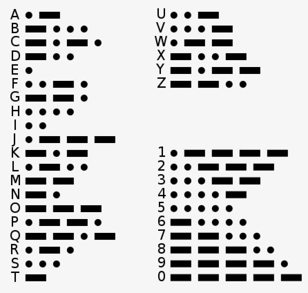
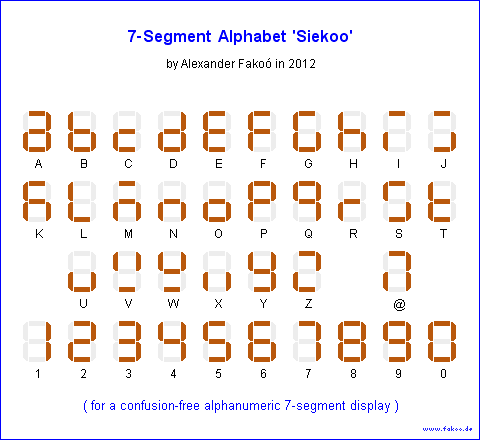

# MORSE CODE TRANSMITTER and RECEIVER

### Team members

* Ivan Lipták [@240942](https://github.com/IvoSvk)(responsible for VHDL transmitter module and cooperation with receiver)
* Jan Ševčík [@xsevci71](https://github.com/JanSevcikk)(responsible for VHDL project github completation and documentation and transmitter module)
* Martin Monček [@240954](https://github.com/)(responsible for  VHDL receiver module and documentation fixes)

### Table of contents 

* [Theoretical description and explanation](#theo)
* [Goals](#goals)
* [Hardware description of demo application](#hardware)
* [Software description](#software)
* [Component(s) simulation](#component)
* [Instructions](#instruction)
* [References](#references)

## Theoretical description and explanation

Enter a description of the problem and how to solve it.

## GOALS of the work
The main goal of this project is to create a Morse Code Transmitter and Reciever. Project is made within subject Digital Electronics (2022/23). For project is used board Arty-A7-50T [ref](https://digilent.com/shop/arty-a7-100t-artix-7-fpga-development-board/). On this board is used buttons, switches and I/O ports and showing input and output on the 7-segment display. For coding is used IDE Vivado 2020.2.  

First part was to made transmitter. Signals are entered via button, like in real-life morse code usage (like telegraphs) - short hold for dot and long hold for dash. Each symbol is displayed on the 7-seg display ligtning corresponding a-g segments which coresponds with English alphabet and numbers. 

Second part is receiver, which needs to receive standardized input send by other device via XXXX. The receiver....
### Alphabet and 7seg description

| **Character** | **Binary** | **Character** | **Binary** | **Character** | **Binary** |
   | :-: | :-: | :-: | :-: | :-: | :-: |
   | A | 000 000 | J | 001 001 | S | 010 010 |
   | B | 000 001 | K | 001 010 | T | 010 011 |
   | C | 000 010 | L | 001 011 | U | 010 100 |
   | D | 000 011 | M | 001 100 | V | 010 101 |
   | E | 000 100 | N | 001 101 | W | 010 110 |
   | F | 000 101 | O | 001 110 | X | 010 111 |
   | G | 000 110 | P | 001 111 | Y | 011 000 |
   | H | 000 111 | Q | 010 000 | Z | 011 001 |
   | I | 001 000 | R | 010 001 | @ | 100 100 |
   
#### Numbers represented in binary

| **Character** | **Binary** | **Character** | **Binary** |
   | :-: | :-: | :-: | :-: |
   | 0 | 011 010 | 5 | 011 111 |
   | 1 | 011 011 | 6 | 100 000 |
   | 2 | 011 100 | 7 | 100 001 |
   | 3 | 011 101 | 8 | 100 010 |
   | 4 | 011 110 | 9 | 100 011 |
  
#### Morse alphabet

    

#### 7-seg alphabet implementation

To display whole alphabet on 7-seg display we use 7-segment alphabet 'Seikoo' by Alexander Fakoó

## Hardware description of demo application
### Board - Nexys A7-50T
The Nexys A7 board is a complete, ready-to-use digital circuit development platform based on the latest Artix-7™ Field Programmable Gate Array (FPGA) from Xilinx®. With its large, high-capacity FPGA, generous external memories, and collection of USB, Ethernet, and other ports, the Nexys A7 can host designs ranging from introductory combinational circuits to powerful embedded processors. Several built-in peripherals, including an accelerometer, temperature sensor, MEMs digital microphone, a speaker amplifier, and several I/O devices allow the Nexys A7 to be used for a wide range of designs without needing any other components.

From board are used:

### Buttons
Project uses two buttons. One for testing purposes - master reset, which resets all values to zero if the program happens to stuck in loop or another problem. Second (right) button is used to trancieve made text out.

### Switches
Switches are used for changing ASCII code. Using 8bit table to ASCII. Switches are used to change values 0 and 1. 

### 7seg display 
Used for shoved receiver/trasmitting alphabets and numbers. Code is based on existing code hex_7seg from lessons with minor changes.

## Software description

### Transmitter

Put flowchats/state diagrams of your algorithm(s) and direct links to source/testbench files in `src` and `sim` folders. 

### Receiver

### Component(s) simulation
### Transmitter

Write descriptive text and simulation screenshots of your components.
### Receiver

## Instructions and video

How to use Morse transmitter and receiver:
### 1. Transmitting part
Use bottom switches, to change ASCII values to made your desired value showed on 7seg display. XXXXXXXXXX

### 2. Receiving part

[Video of working prototype](youtube.com)

## References

1. [Board](https://digilent.com/reference/programmable-logic/nexys-a7/start)
2. Babla
3. [display driver](https://github.com/tomas-fryza/digital-electronics-1/tree/master/labs/07-display_driver)
4. [Decoder design in VHDL](https://www.researchgate.net/publication/305379385_Morse_code_decoder_design_in_VHDL_using_FPGA_Spartan_3E_development_kit)